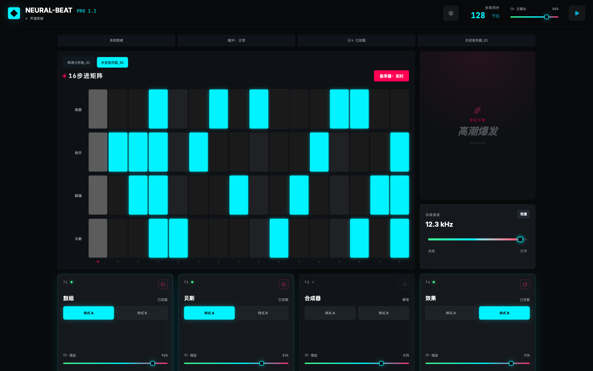

# Neural-Beat Pro

Neural-Beat Pro is a browser-based electronic music performance console. It combines a live step sequencer, synth-driven loops, master filtering, per-track gain, a spectrum visualizer, and a one-click drop engine into a compact DJ control surface.



## Features

- Live transport with BPM sync and master output gain.
- Four performance tracks: drums, bass, synth, and FX.
- Two loop patterns per track with persistent local state.
- 16-step sequencer for kick, clap, hi-hat, and bass programming.
- Tone.js audio engine with per-track buses, master filter, analyzer, and stable envelope-triggered percussion.
- Dedicated settings module for Chinese / English and light / dark appearance.
- Dark control-surface UI optimized for live performance.

## Tech Stack

- React 19
- Vite 6
- TypeScript
- Tailwind CSS 4
- Tone.js
- Zustand
- Lucide React

## Run Locally

Prerequisite: Node.js

```bash
npm install
npm run dev
```

The dev server runs at:

```text
http://localhost:3000
```

## Build And Check

```bash
npm run lint
npm run build
```

## Environment

The project keeps the original AI Studio environment shape. If Gemini-powered features are added later, copy `.env.example` to `.env.local` and set:

```bash
GEMINI_API_KEY="YOUR_KEY"
```

The current live DJ controls run locally in the browser and do not require an API key.
